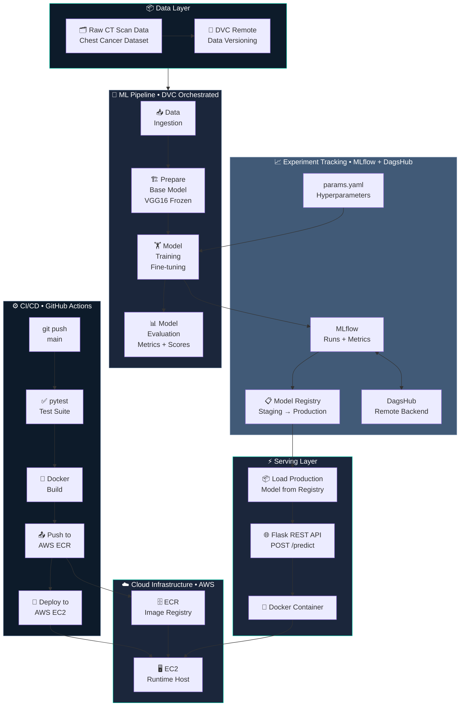
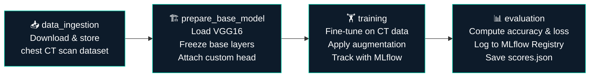
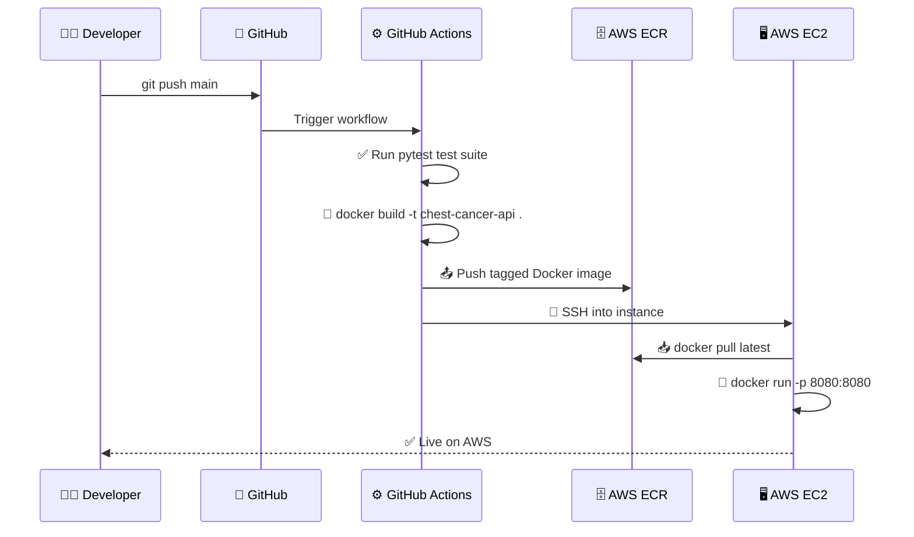
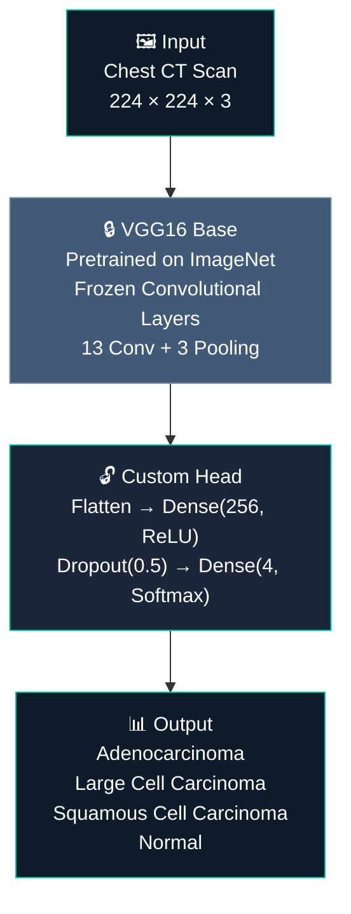
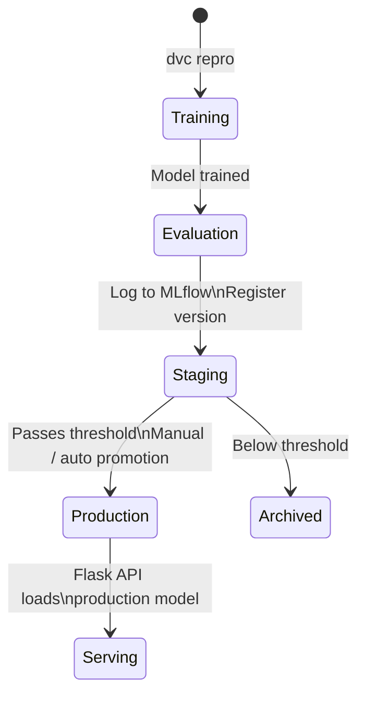

<div align="center">


<br/>

[](https://python.org)
[](https://tensorflow.org)
[](https://keras.io/api/applications/vgg/)
[](https://flask.palletsprojects.com)
[](https://docker.com)
[](https://aws.amazon.com)
[](https://dvc.org)
[](https://mlflow.org)
[](https://github.com/features/actions)
[](LICENSE)

<br/>

> **A production-grade MLOps pipeline for medical imaging** — classifying chest CT scans as cancerous or normal using a fine-tuned VGG16 model, with full experiment tracking, DVC-versioned pipeline, MLflow Model Registry, and automated AWS deployment via GitHub Actions.

<br/>

[🏗️ Architecture](#️-system-architecture) · [⚡ Quick Start](#-getting-started) · [📖 Documentation](#-table-of-contents) · [📊 Results](#-results)

---

</div>

## 📌 Table of Contents

- [Overview](#-overview)
- [System Architecture](#️-system-architecture)
- [ML Pipeline](#-ml-pipeline-dvc)
- [CI/CD Pipeline](#️-cicd-pipeline)
- [Tech Stack](#-tech-stack)
- [Project Structure](#-project-structure)
- [Model Details](#-model-details)
- [MLflow Model Registry](#-mlflow-model-registry)
- [API Reference](#-api-reference)
- [Results](#-results)
- [Getting Started](#-getting-started)
- [Development Workflow](#-development-workflow)
- [MLOps Skills Demonstrated](#-mlops-skills-demonstrated)
- [Author](#-author)

---

## 🔍 Overview

**End-to-End Chest Cancer Classification** is a full-stack medical imaging MLOps system. It takes chest CT scan images as input and classifies them as **Adenocarcinoma**, **Large Cell Carcinoma**, **Squamous Cell Carcinoma**, or **Normal** — using a fine-tuned **VGG16** convolutional neural network.

The project is built with production engineering at its core: a reproducible DVC pipeline, MLflow experiment tracking with a Model Registry, a hardened Flask inference API, Docker containerization, and automated cloud deployment to AWS — all orchestrated via GitHub Actions.

### ✨ Key Highlights

| Feature | Description |
|---|---|
| 🧠 **VGG16 Transfer Learning** | Fine-tuned deep CNN on chest CT scan imagery for cancer detection |
| 🔬 **Medical Imaging Pipeline** | End-to-end from raw CT data to production-ready inference |
| 📊 **MLflow Model Registry** | Environment-gated model promotion: Staging → Production |
| 🔁 **DVC Pipeline** | Reproducible 4-stage pipeline tracked with `dvc.yaml` |
| 🧪 **Test Suite** | pytest-based unit and integration testing for pipeline reliability |
| 🌐 **Flask REST API** | Hardened inference endpoint with image upload support |
| 🐳 **Dockerized** | Consistent dev-to-prod containerization |
| ☁️ **AWS Deployment** | Auto-deployed to EC2 via ECR on every push to `main` |
| ⚙️ **GitHub Actions CI/CD** | Fully automated build → test → push → deploy workflow |

---

## 🏗️ System Architecture

The system is organized into five integrated layers: data versioning, model training, experiment tracking with registry, API serving, and automated cloud deployment.



---

## 🔄 ML Pipeline (DVC)

The full pipeline is defined in `dvc.yaml` with four sequential stages. DVC caches intermediate outputs and only re-runs stages whose inputs have changed — enabling fast, reproducible iteration.



```bash
# Reproduce the full pipeline (only changed stages re-run)
dvc repro

# View the DAG
dvc dag

# Run an experiment with different hyperparameters
dvc exp run --set-param training.EPOCHS=20 --set-param training.LEARNING_RATE=0.0001
dvc exp show

# Sync artifacts with DVC remote
dvc push   # Upload to remote storage
dvc pull   # Download tracked artifacts
```

---

## ⚙️ CI/CD Pipeline

Every push to `main` triggers the full deployment pipeline automatically — zero manual intervention.



---

## 🛠️ Tech Stack

<div align="center">

| Layer | Technology |
|---|---|
| **Deep Learning** | TensorFlow / Keras, VGG16 (ImageNet pretrained) |
| **Transfer Learning** | Fine-tuned VGG16 with custom classification head |
| **Experiment Tracking** | MLflow, DagsHub |
| **Model Registry** | MLflow Model Registry (Staging → Production) |
| **Data & Pipeline Versioning** | DVC (`dvc.yaml`, `dvc.lock`) |
| **Configuration Management** | `config/config.yaml`, `params.yaml` |
| **Testing** | pytest (unit + integration test suite) |
| **API Serving** | Flask, Jinja2 Templates |
| **Containerization** | Docker |
| **CI/CD** | GitHub Actions |
| **Cloud** | AWS EC2 (compute), AWS ECR (image registry) |
| **Language** | Python 3.10+ |

</div>

---

## 📁 Project Structure

```
End-to-end-Chest-Cancer-Classification/
│
├── .github/
│   └── workflows/                  # GitHub Actions CI/CD pipeline
│
├── .dvc/                           # DVC configuration & cache
├── dvc.yaml                        # Pipeline stage definitions
├── params.yaml                     # Model hyperparameters
│
├── config/
│   └── config.yaml                 # Path & artifact configuration
│
├── src/cnnClassifier/
│   ├── components/                 # Pipeline stage implementations
│   │   ├── data_ingestion.py       # Dataset download & extraction
│   │   ├── prepare_base_model.py   # VGG16 model construction
│   │   ├── model_trainer.py        # Training loop + augmentation
│   │   └── model_evaluation.py     # Metrics logging + MLflow registry
│   │
│   ├── pipeline/                   # Stage orchestration scripts
│   │   ├── stage_01_data_ingestion.py
│   │   ├── stage_02_prepare_base_model.py
│   │   ├── stage_03_model_training.py
│   │   └── stage_04_model_evaluation.py
│   │
│   ├── entity/                     # Dataclass configs for each stage
│   ├── config/                     # ConfigurationManager
│   └── utils/                      # Shared utilities
│
├── model/                          # Saved model artifacts
│   └── model.h5                    # Trained VGG16 model weights
│
├── research/                       # Jupyter notebooks for EDA & prototyping
│
├── templates/                      # Jinja2 HTML templates for web UI
│
├── app.py                          # Flask REST API entry point
├── main.py                         # Full pipeline runner
├── scores.json                     # Latest evaluation metrics
├── Dockerfile
├── requirements.txt
├── setup.py
└── template.py                     # Project scaffolding script
```

---

## 🧠 Model Details

### Architecture: Fine-Tuned VGG16



### Training Configuration (`params.yaml`)

```yaml
training:
  EPOCHS: 10
  BATCH_SIZE: 16
  IS_AUGMENTATION: True
  IMAGE_SIZE: [224, 224, 3]
  LEARNING_RATE: 0.01

prepare_base_model:
  IMAGE_SIZE: [224, 224, 3]
  INCLUDE_TOP: False
  WEIGHTS: imagenet
  CLASSES: 4
```

---

## 📋 MLflow Model Registry

Models are automatically promoted through environments based on evaluation thresholds. The evaluation stage logs the trained model to MLflow and registers it in the Model Registry.



**DagsHub Tracking:** [View Experiments →](https://dagshub.com/omarhatem44/End-to-end-Chest-Cancer-Classification.mlflow/#/experiments)

---

## 🌐 API Reference

**Base URL:** `http://<your-ec2-host>:8080`

### `POST /predict`

Upload a chest CT scan image and receive a cancer classification.

**Request:** `multipart/form-data`

```bash
curl -X POST http://localhost:8080/predict \
  -F "file=@chest_scan.jpg"
```

**Response:**
```json
{
  "prediction": "Adenocarcinoma",
  "confidence": 0.91,
  "all_scores": {
    "Adenocarcinoma": 0.91,
    "Large Cell Carcinoma": 0.04,
    "Squamous Cell Carcinoma": 0.03,
    "Normal": 0.02
  }
}
```

### `GET /`

Returns the web UI for manual image upload and prediction.

### `GET /train`

Triggers a full pipeline re-run (`dvc repro`) on the server.

---

## 📊 Results

<div align="center">

| Metric | Score |
|---|---|
| **Accuracy** | *See `scores.json` / MLflow run* |
| **Loss** | *See `scores.json` / MLflow run* |
| **Val Accuracy** | *See MLflow experiment dashboard* |
| **Val Loss** | *See MLflow experiment dashboard* |

</div>

> 📈 Full experiment history, metric curves, and model version comparisons are tracked in **MLflow on DagsHub**:
> [dagshub.com/omarhatem44/End-to-end-Chest-Cancer-Classification.mlflow](https://dagshub.com/omarhatem44/End-to-end-Chest-Cancer-Classification.mlflow/#/experiments)

---

## 🚀 Getting Started

### Prerequisites

```
Python 3.10+  |  Docker  |  DVC  |  AWS CLI
```

```bash
pip install dvc mlflow tensorflow
```

### 1. Clone the Repository

```bash
git clone https://github.com/omarhatem44/End-to-end-Chest-Cancer-Classification-.git
cd End-to-end-Chest-Cancer-Classification-
```

### 2. Install Dependencies

```bash
pip install -r requirements.txt
```

### 3. Pull Data & Model Artifacts

```bash
dvc pull
```

### 4. Reproduce the ML Pipeline

```bash
dvc repro
```

### 5. Run Locally with Docker

```bash
docker build -t chest-cancer-api .
docker run -p 8080:8080 chest-cancer-api
```

### 6. Access the Web UI

Open your browser at `http://localhost:8080` and upload a chest CT scan image.

---

## 🔧 Development Workflow

Follow this workflow when modifying any pipeline stage:

```
1. Update config/config.yaml       → Add paths or artifact locations
2. Update params.yaml              → Adjust hyperparameters
3. Update entity/                  → Define or update dataclasses
4. Update config/configuration.py  → Update ConfigurationManager
5. Update components/              → Implement stage logic
6. Update pipeline/                → Wire stage into pipeline
7. Update main.py                  → Register stage in full runner
8. Update dvc.yaml                 → Define stage deps/outputs
9. Run: dvc repro                  → Execute updated pipeline
10. Run: pytest                    → Verify test suite passes
```

---

## 🧠 MLOps Skills Demonstrated

<div align="center">

| MLOps Pillar | Implementation |
|---|---|
| **Transfer Learning** | VGG16 pretrained on ImageNet, fine-tuned for 4-class medical imaging |
| **Data Versioning** | DVC tracks raw CT data and processed artifacts |
| **Pipeline Reproducibility** | `dvc repro` re-runs only changed stages from `dvc.yaml` |
| **Experiment Tracking** | MLflow logs all runs: loss, accuracy, hyperparameters |
| **Model Registry** | MLflow Model Registry with Staging → Production promotion |
| **Configuration Management** | Centralized `config.yaml` + `params.yaml` with entity dataclasses |
| **Test Suite** | pytest covering pipeline components and API endpoints |
| **Model Serving** | Flask API with image upload, prediction, and web UI |
| **Containerization** | Docker for consistent, reproducible deployment |
| **CI/CD Automation** | GitHub Actions: test → build → push ECR → deploy EC2 |
| **Cloud Deployment** | Live inference on AWS EC2 with image from AWS ECR |

</div>

---

## 👤 Author

<div align="center">

**Omar Hatem**

🎓 Computer Science Student — Modern Academy for Computer Science, Cairo, Egypt
💼 ML Engineer · MLOps Enthusiast · Medical AI Builder

[](https://github.com/omarhatem44)
[](https://linkedin.com/in/omar-hatem-44)
[](https://dagshub.com/omarhatem44/End-to-end-Chest-Cancer-Classification.mlflow)

</div>

---

<div align="center">

*Built end-to-end with production MLOps practices — medical imaging, transfer learning, and automated cloud deployment* 🩺🚀

⭐ **Star this repo** if you found it useful!

</div>
