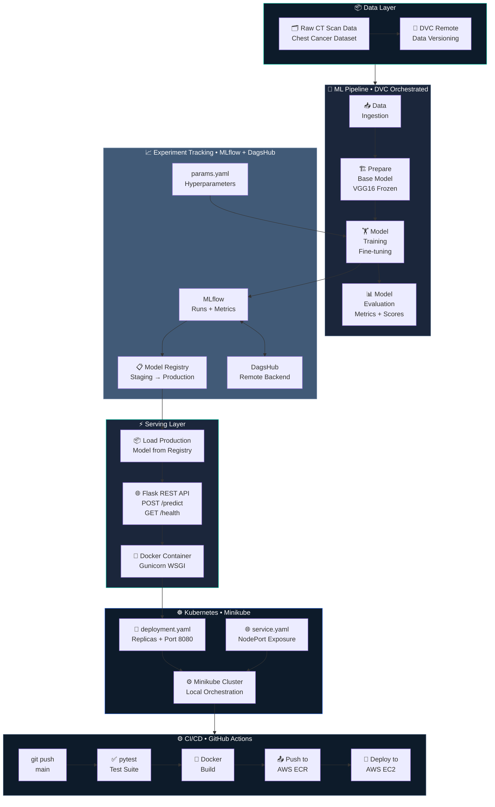
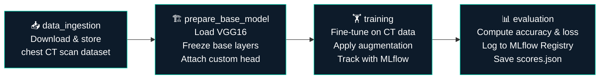
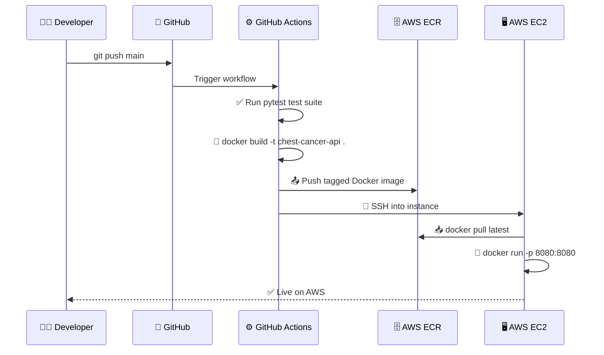
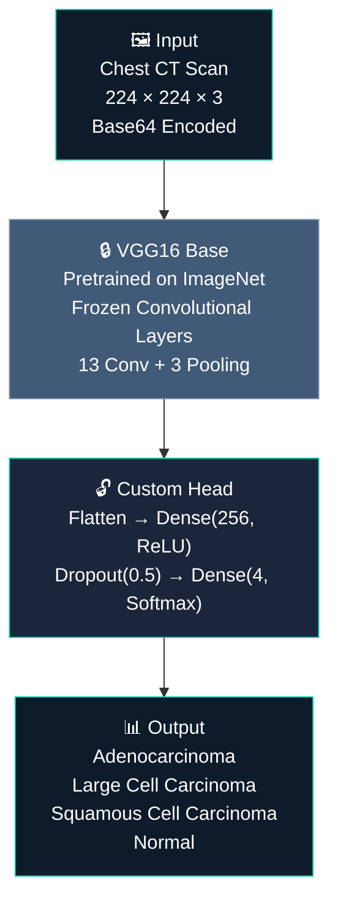
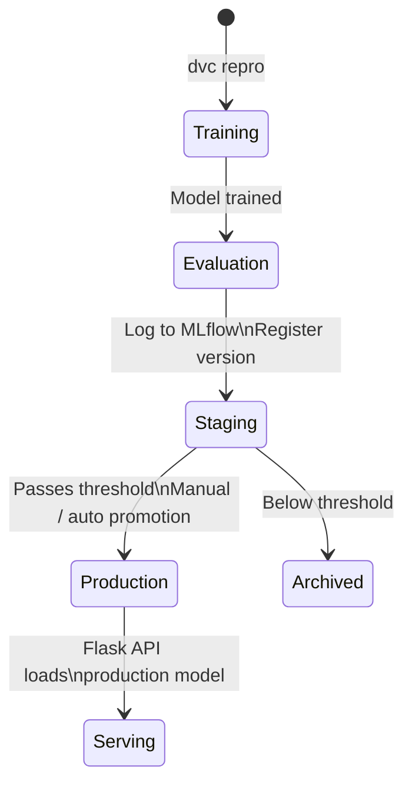
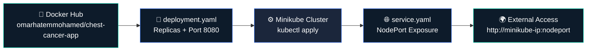

<div align="center">


<br/>

[](https://python.org)
[](https://tensorflow.org)
[](https://keras.io/api/applications/vgg/)
[](https://flask.palletsprojects.com)
[](https://docker.com)
[](https://minikube.sigs.k8s.io)
[](https://aws.amazon.com)
[](https://dvc.org)
[](https://mlflow.org)
[](https://github.com/features/actions)
[](http://13.221.125.15:8080/)
[](LICENSE)

<br/>

> **A production-grade MLOps pipeline for medical imaging** — classifying chest CT scans as cancerous or normal using a fine-tuned VGG16 model, with full experiment tracking, DVC-versioned pipeline, MLflow Model Registry, Docker containerization, and Kubernetes orchestration via Minikube.

<br/>

[🏗️ Architecture](#️-system-architecture) · [⚡ Quick Start](#-getting-started) · [📖 Documentation](#-table-of-contents) · [📊 Results](#-results) · [🌐 Live Demo](http://13.221.125.15:8080/)

---

</div>

## 📌 Table of Contents

- [Overview](#-overview)
- [System Architecture](#️-system-architecture)
- [ML Pipeline](#-ml-pipeline-dvc)
- [CI/CD Pipeline](#️-cicd-pipeline)
- [Tech Stack](#-tech-stack)
- [Project Structure](#-project-structure)
- [Model Details](#-model-details)
- [MLflow Model Registry](#-mlflow-model-registry)
- [Backend API Reference](#-backend-api-reference)
- [Frontend UI](#️-frontend-ui)
- [Containerization](#-containerization-docker)
- [Kubernetes Deployment](#️-kubernetes-deployment-minikube)
- [Results](#-results)
- [Getting Started](#-getting-started)
- [Development Workflow](#-development-workflow)
- [Challenges Faced](#️-challenges-faced)
- [Key Learnings](#-key-learnings)
- [Future Improvements](#-future-improvements)
- [MLOps Skills Demonstrated](#-mlops-skills-demonstrated)
- [Author](#-author)

---

## 🔍 Overview

**End-to-End Chest Cancer Classification** is a full-stack medical imaging MLOps system. It takes chest CT scan images as input and classifies them as **Adenocarcinoma**, **Large Cell Carcinoma**, **Squamous Cell Carcinoma**, or **Normal** — using a fine-tuned **VGG16** convolutional neural network.

The focus of this project is not only model performance but also **production-level deployment using MLOps practices**: a reproducible DVC pipeline, MLflow experiment tracking with a Model Registry, a hardened Flask inference API, Docker containerization, and Kubernetes orchestration via Minikube.

### ✨ Key Highlights

| Feature | Description |
|---|---|
| 🧠 **VGG16 Transfer Learning** | Fine-tuned deep CNN on chest CT scan imagery for cancer detection |
| 🔬 **Medical Imaging Pipeline** | End-to-end from raw CT data to production-ready inference |
| 📊 **MLflow Model Registry** | Environment-gated model promotion: Staging → Production |
| 🔁 **DVC Pipeline** | Reproducible 4-stage pipeline tracked with `dvc.yaml` |
| 🧪 **Test Suite** | pytest-based unit and integration testing for pipeline reliability |
| 🌐 **Flask REST API** | Hardened inference endpoint with health check and CORS support |
| 🐳 **Dockerized** | Gunicorn-served container pushed to Docker Hub |
| ☸️ **Kubernetes Deployment** | Deployed on Minikube with Deployment + NodePort Service YAMLs |
| ⚙️ **GitHub Actions CI/CD** | Fully automated build → test → push → deploy workflow |
| 🚀 **Live Demo** | [Try it live on AWS EC2 →](http://13.221.125.15:8080/) |

---

## 🏗️ System Architecture

The system is organized into six integrated layers: data versioning, model training, experiment tracking, API serving, containerization, and Kubernetes orchestration.

```
User → Web UI → Flask API → ML Model → Prediction → Response
                          ↓
                     Docker Container
                          ↓
                     Kubernetes (Minikube)
```



---

## 🔄 ML Pipeline (DVC)

The full pipeline is defined in `dvc.yaml` with four sequential stages. DVC caches intermediate outputs and only re-runs stages whose inputs have changed — enabling fast, reproducible iteration.



```bash
# Reproduce the full pipeline (only changed stages re-run)
dvc repro

# View the DAG
dvc dag

# Run an experiment with different hyperparameters
dvc exp run --set-param training.EPOCHS=20 --set-param training.LEARNING_RATE=0.0001
dvc exp show

# Sync artifacts with DVC remote
dvc push   # Upload to remote storage
dvc pull   # Download tracked artifacts
```

---

## ⚙️ CI/CD Pipeline

Every push to `main` triggers the full deployment pipeline automatically — zero manual intervention.



---

## 🛠️ Tech Stack

<div align="center">

| Layer | Technology |
|---|---|
| **Deep Learning** | TensorFlow / Keras, VGG16 (ImageNet pretrained) |
| **Transfer Learning** | Fine-tuned VGG16 with custom classification head |
| **Experiment Tracking** | MLflow, DagsHub |
| **Model Registry** | MLflow Model Registry (Staging → Production) |
| **Data & Pipeline Versioning** | DVC (`dvc.yaml`, `dvc.lock`) |
| **Configuration Management** | `config/config.yaml`, `params.yaml` |
| **Testing** | pytest (unit + integration test suite) |
| **API Serving** | Flask + Gunicorn, CORS enabled |
| **Containerization** | Docker (pushed to Docker Hub) |
| **Orchestration** | Kubernetes (Minikube) — Deployment + NodePort Service |
| **CI/CD** | GitHub Actions |
| **Cloud** | AWS EC2 (compute), AWS ECR (image registry) |
| **Language** | Python 3.10+ |

</div>

---

## 📁 Project Structure

```
├── 📁 .dvc
│   ├── ⚙️ .gitignore
│   └── 📄 config
├── 📁 .github
│   └── 📁 workflows
│       └── ⚙️ main.yaml
├── 📁 K8s
│   ├── ⚙️ deployment.yaml
│   └── ⚙️ service.yaml
├── 📁 config
│   └── ⚙️ config.yaml
├── 📁 logs
├── 📁 model
│   └── 📄 model.h5
├── 📁 research
│   ├── 📄 01_data_ingestion.ipynb
│   ├── 📄 02_prepare_base_model.ipynb
│   ├── 📄 03_model_trainer.ipynb
│   ├── 📄 04_model_evaluation_with_mlflow.ipynb
│   └── 📄 trials.ipynb
├── 📁 src
│   └── 📁 cnnClassifier
│       ├── 📁 components
│       │   ├── 🐍 __init__.py
│       │   ├── 🐍 data_ingestion.py
│       │   ├── 🐍 model_evaluation_mlflow.py
│       │   ├── 🐍 model_trainer.py
│       │   └── 🐍 prepare_base_model.py
│       ├── 📁 config
│       │   ├── 🐍 __init__.py
│       │   └── 🐍 configuration.py
│       ├── 📁 constants
│       │   └── 🐍 __init__.py
│       ├── 📁 entity
│       │   ├── 🐍 __init__.py
│       │   └── 🐍 config_entity.py
│       ├── 📁 pipeline
│       │   ├── 🐍 __init__.py
│       │   ├── 🐍 prediction.py
│       │   ├── 🐍 stage_01_data_ingestion.py
│       │   ├── 🐍 stage_02_prepare_base_model.py
│       │   ├── 🐍 stage_03_trainer_model.py
│       │   └── 🐍 stage_04_model_evaluation.py
│       ├── 📁 utils
│       │   ├── 🐍 __init__.py
│       │   └── 🐍 common.py
│       └── 🐍 __init__.py
├── 📁 templates
│   └── 🌐 index.html
├── ⚙️ .dockerignore
├── ⚙️ .dvcignore
├── ⚙️ .gitignore
├── 🐳 Dockerfile
├── 📄 LICENSE
├── 📝 README.md
├── 🐍 app.py
├── 📄 chest-classifier.pem
├── ⚙️ dvc.yaml
├── 🐍 main.py
├── ⚙️ params.yaml
├── 📄 requirements.txt
├── ⚙️ scores.json
├── 🐍 setup.py
└── 🐍 template.py
```

---

## 🧠 Model Details

### Architecture: Fine-Tuned VGG16



### Model Integration

| Property | Detail |
|---|---|
| **Format** | `.h5` (Keras SavedModel) |
| **Loaded via** | `PredictionPipeline(self.filename)` |
| **Input** | Base64-encoded CT scan image |
| **Output** | Classification label |

### Training Configuration (`params.yaml`)

```yaml
training:
  EPOCHS: 10
  BATCH_SIZE: 16
  IS_AUGMENTATION: True
  IMAGE_SIZE: [224, 224, 3]
  LEARNING_RATE: 0.01

prepare_base_model:
  IMAGE_SIZE: [224, 224, 3]
  INCLUDE_TOP: False
  WEIGHTS: imagenet
  CLASSES: 4
```

---

## 📋 MLflow Model Registry

Models are automatically promoted through environments based on evaluation thresholds. The evaluation stage logs the trained model to MLflow and registers it in the Model Registry.



**DagsHub Tracking:** [View Experiments →](https://dagshub.com/omarhatem44/End-to-end-Chest-Cancer-Classification.mlflow/#/experiments)

---

## 🌐 Backend API Reference

**Base URL:** [http://13.221.125.15:8080](http://13.221.125.15:8080/)

The Flask backend has CORS enabled for frontend communication and uses JSON-based messaging throughout.

### `GET /`

Returns the web UI for manual image upload and prediction.

---

### `POST /predict`

Accepts a base64-encoded CT scan image and returns a cancer classification.

**Request:**
```json
{
  "image": "base64_string"
}
```

**Response:**
```json
{
  "prediction": "Cancer / Normal"
}
```

**cURL Example:**
```bash
curl -X POST http://13.221.125.15:8080/predict \
  -H "Content-Type: application/json" \
  -d '{"image": "<base64_encoded_image>"}'
```

---

### `GET /health`

Used for monitoring and Kubernetes readiness/liveness probes.

**Response:**
```json
{
  "status": "healthy"
}
```

---

## 🖥️ Frontend UI

A lightweight HTML interface served directly by Flask:

- Upload a chest CT scan image
- Trigger the `/predict` endpoint
- Display the classification result in real time

---

## 🐳 Containerization (Docker)

### Dockerfile Overview

```dockerfile
FROM python:3.10-slim-bookworm

WORKDIR /app
COPY requirements.txt .
RUN pip install --no-cache-dir -r requirements.txt
COPY . .

CMD ["gunicorn", "-w", "4", "-b", "0.0.0.0:8080", "app:app"]
```

The app is served via **Gunicorn** (4 workers) for production-grade WSGI performance.

### Build & Push to Docker Hub

```bash
# Build image locally
docker build -t omarhatemmohamed/chest-cancer-app .

# Push to Docker Hub
docker push omarhatemmohamed/chest-cancer-app
```

> **Final image size:** ≈ 2.6 GB

---

## ☸️ Kubernetes Deployment (Minikube)

### Why Minikube?

Due to AWS EC2 quota limitations on the free-tier account (EC2 Fleet Request limits and EKS NodeGroup creation failures in `eu-west-1`), deployment was completed locally using **Minikube** as a production-equivalent Kubernetes environment. The full EKS architecture, manifests, and deployment workflow were designed and validated — the cluster is migration-ready once quota is approved.

### Manifests

**`deployment.yaml`** — defines the container image, exposed port (8080), and number of replicas.

**`service.yaml`** — exposes the application externally via a `NodePort` service.

### Deployment Steps

```bash
# Start the local cluster
minikube start

# Apply manifests
kubectl apply -f deployment.yaml
kubectl apply -f service.yaml
```

### Access the Application

```bash
# Auto-open in browser
minikube service <service-name>
```

Or access directly via:

```
http://<minikube-ip>:<nodeport>
```

### Kubernetes Flow



---

## 📊 Results

<div align="center">

| Metric | Score |
|---|---|
| **Accuracy** | *See `scores.json` / MLflow run* |
| **Loss** | *See `scores.json` / MLflow run* |
| **Val Accuracy** | *See MLflow experiment dashboard* |
| **Val Loss** | *See MLflow experiment dashboard* |

</div>

> 📈 Full experiment history, metric curves, and model version comparisons are tracked in **MLflow on DagsHub**:
> [dagshub.com/omarhatem44/End-to-end-Chest-Cancer-Classification.mlflow](https://dagshub.com/omarhatem44/End-to-end-Chest-Cancer-Classification.mlflow/#/experiments)

### Testing & Validation

| Scenario | Status |
|---|---|
| UI image upload | ✅ |
| API JSON response | ✅ |
| Model inference | ✅ |
| Docker container execution | ✅ |
| Kubernetes service exposure | ✅ |

---

## 🚀 Getting Started

### Prerequisites

```
Python 3.10+  |  Docker  |  DVC  |  kubectl  |  Minikube
```

```bash
pip install dvc mlflow tensorflow
```

### 1. Clone the Repository

```bash
git clone https://github.com/omarhatem44/End-to-end-Chest-Cancer-Classification-.git
cd End-to-end-Chest-Cancer-Classification-
```

### 2. Install Dependencies

```bash
pip install -r requirements.txt
```

### 3. Pull Data & Model Artifacts

```bash
dvc pull
```

### 4. Reproduce the ML Pipeline

```bash
dvc repro
```

### 5. Run Locally with Docker

```bash
docker build -t chest-cancer-api .
docker run -p 8080:8080 chest-cancer-api
```

### 6. Deploy on Kubernetes (Minikube)

```bash
minikube start
kubectl apply -f deployment.yaml
kubectl apply -f service.yaml
minikube service <service-name>
```

---

### 🌐 Live Demo

The API is deployed and running live on AWS EC2:

👉 **[http://13.221.125.15:8080/](http://13.221.125.15:8080/)**

Upload a chest CT scan image and get a real-time cancer classification — no setup required.

---

## 🔧 Development Workflow

Follow this workflow when modifying any pipeline stage:

```
1. Update config/config.yaml       → Add paths or artifact locations
2. Update params.yaml              → Adjust hyperparameters
3. Update entity/                  → Define or update dataclasses
4. Update config/configuration.py  → Update ConfigurationManager
5. Update components/              → Implement stage logic
6. Update pipeline/                → Wire stage into pipeline
7. Update main.py                  → Register stage in full runner
8. Update dvc.yaml                 → Define stage deps/outputs
9. Run: dvc repro                  → Execute updated pipeline
10. Run: pytest                    → Verify test suite passes
```

---

## ⚠️ Challenges Faced

### 1. Flask Route Issues
- `/health` endpoint was initially missing → caused 404 errors in Kubernetes readiness probes
- **Fix:** Added dedicated health check endpoint returning `{"status": "healthy"}`

### 2. HTTP Method Errors
- `/predict` requires `POST` → frontend was sending an incorrect request method
- **Fix:** Corrected the frontend request configuration

### 3. Docker Issues
- Docker daemon not running during initial build attempts
- Missing `Dockerfile` discovered mid-deployment
- Large final image size (~2.6 GB) due to TensorFlow dependencies

### 4. AWS EKS Deployment Failure — EC2 vCPU Quota Exhausted

This was the most operationally complex challenge of the project and resulted in hands-on experience with real AWS infrastructure limits and the support escalation process.

**What happened:**

When attempting to provision an EKS cluster (`chest-prod-2`) in `eu-west-1` using `eksctl`, the cluster control plane was created successfully via CloudFormation, but the managed node group (`ng-c2b5e0b7`) entered a `CREATE_FAILED` / `ROLLBACK_IN_PROGRESS` state after approximately 35 minutes of waiting.

```
Error: exceeded max wait time for StackCreateComplete waiter
failed to create cluster "chest-prod-2"
```

**Root cause — identified via CloudFormation Events:**

```
AsgInstanceLaunchFailures: You've reached your quota for maximum
Fleet Requests for this account. Launching EC2 instance failed.
```

The free-tier AWS account had a **0 vCPU quota** for Running On-Demand Standard instances in `eu-west-1`. Even a single `t3.micro` node (2 vCPUs) could not be launched.

**Debugging steps taken:**

1. Inspected the CloudFormation stack events in the AWS console to identify the exact failure resource (`ManagedNodeGroup`) and error code (`AsgInstanceLaunchFailures`)
2. Navigated to **Service Quotas → Amazon EC2 → Running On-Demand Standard (A, C, D, H, I, M, R, T, Z) instances**
3. Confirmed the applied quota in `eu-west-1` was **0 vCPUs** with **0 utilization** — the bottleneck
4. Submitted a quota increase request for **15 vCPUs** in `eu-west-1`
5. AWS opened a support case (Case `177649325600882`) for manual review, as free-tier accounts do not receive automatic approval for quota increases
6. Added a use-case justification to the support case to expedite review

**Resolution:**

While awaiting quota approval, the failed CloudFormation stacks were cleaned up:

```bash
eksctl delete cluster --name chest-prod-2 --region eu-west-1
```

Kubernetes deployment was then completed using **Minikube** as a production-equivalent local environment. The EKS manifests (`deployment.yaml`, `service.yaml`) remain unchanged and are fully compatible with EKS — migration requires only re-running the `eksctl create cluster` command once the quota is approved.

**Key takeaway:** Cloud infrastructure limits are a real-world operational concern, not just a theoretical one. Diagnosing the failure required reading CloudFormation events, understanding AWS quota scoping per-region, and knowing the difference between automatic and manual quota approval paths.

---

## 🧠 Key Learnings

- Difference between local vs cloud production deployment environments
- Docker image size optimization challenges with heavy ML dependencies
- Kubernetes resource management and NodePort service exposure patterns
- Critical importance of health check endpoints in container orchestration
- How to diagnose and handle AWS CloudFormation stack failures
- How EC2 vCPU quotas are scoped per-region and how to request increases
- How to pivot gracefully from cloud to local Kubernetes without losing deployment fidelity

---

## 🚀 Future Improvements

| Improvement | Description |
|---|---|
| **Multi-stage Docker build** | Reduce image size significantly below ~2.6 GB |
| **Model on S3** | Store `.h5` in S3 instead of baking it into the container |
| **Full CI/CD to K8s** | Extend GitHub Actions to auto-deploy to Kubernetes |
| **AWS EKS migration** | Migrate from Minikube to EKS once eu-west-1 vCPU quota is approved |
| **Monitoring** | Add Prometheus + Grafana dashboards for inference metrics |

---

## 🧠 MLOps Skills Demonstrated

<div align="center">

| MLOps Pillar | Implementation |
|---|---|
| **Transfer Learning** | VGG16 pretrained on ImageNet, fine-tuned for 4-class medical imaging |
| **Data Versioning** | DVC tracks raw CT data and processed artifacts |
| **Pipeline Reproducibility** | `dvc repro` re-runs only changed stages from `dvc.yaml` |
| **Experiment Tracking** | MLflow logs all runs: loss, accuracy, hyperparameters |
| **Model Registry** | MLflow Model Registry with Staging → Production promotion |
| **Configuration Management** | Centralized `config.yaml` + `params.yaml` with entity dataclasses |
| **Test Suite** | pytest covering pipeline components and API endpoints |
| **Model Serving** | Flask + Gunicorn API with base64 input, CORS, and health endpoint |
| **Containerization** | Docker image built and pushed to Docker Hub (~2.6 GB) |
| **Kubernetes Orchestration** | Minikube Deployment + NodePort Service with readiness probes |
| **CI/CD Automation** | GitHub Actions: test → build → push ECR → deploy EC2 |
| **Cloud Deployment** | Live inference on AWS EC2 with image from AWS ECR |
| **Cloud Infrastructure Debugging** | Diagnosed EKS NodeGroup failure via CloudFormation events; navigated AWS quota system and support escalation |

</div>

---

## 👤 Author

<div align="center">

**Omar Hatem**

🎓 Computer Science Student — Modern Academy for Computer Science, Cairo, Egypt
💼 ML Engineer · MLOps Enthusiast · Medical AI Builder

[](https://github.com/omarhatem44)
[](https://linkedin.com/in/omar-hatem-44)
[](https://dagshub.com/omarhatem44/End-to-end-Chest-Cancer-Classification.mlflow)

</div>

---

<div align="center">

*Built end-to-end with production MLOps practices — medical imaging, transfer learning, Docker, Kubernetes, and automated cloud deployment* 🩺🚀

⭐ **Star this repo** if you found it useful!

</div>
