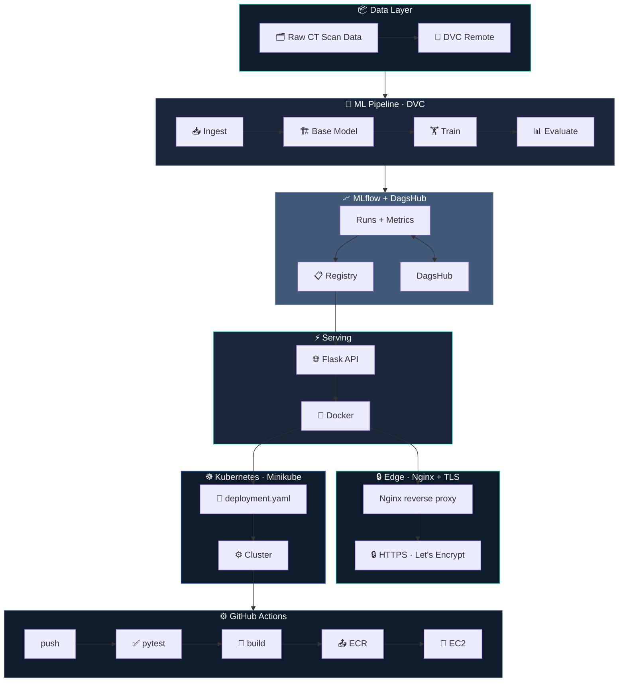
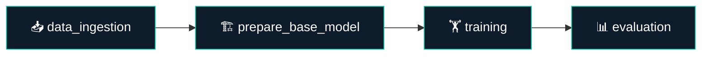
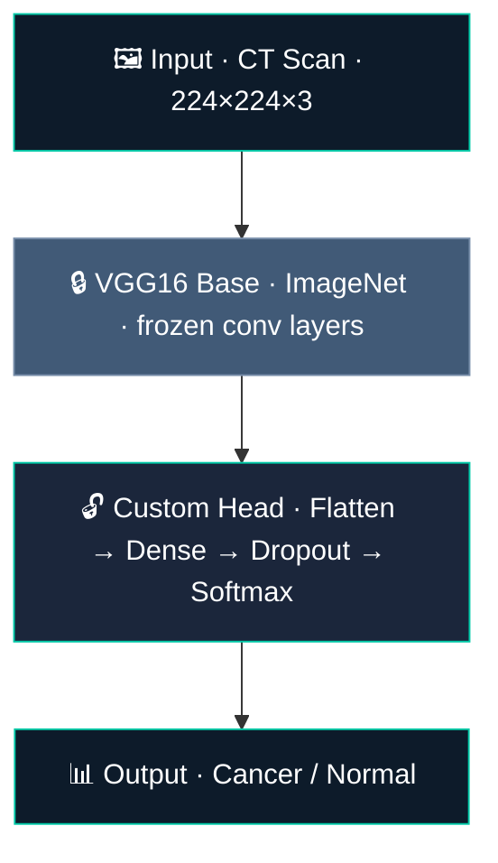
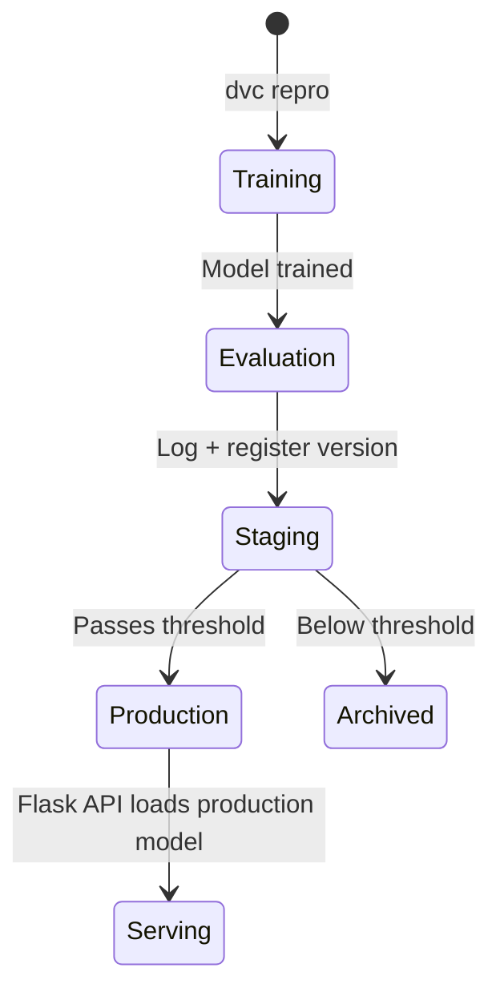
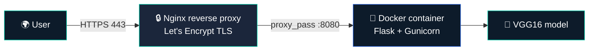

<div align="center">


<br/>

[](https://python.org)
[](https://tensorflow.org)
[](https://keras.io/api/applications/vgg/)
[](https://flask.palletsprojects.com)
[](https://docker.com)
[](https://minikube.sigs.k8s.io)
[](https://aws.amazon.com)
[](https://dvc.org)
[](https://mlflow.org)
[](https://github.com/features/actions)
[](https://omar-pulmoai.duckdns.org)
[](LICENSE)

<br/>

> **A production-grade MLOps pipeline for medical imaging** — classifying chest CT scans as **Cancer** or **Normal** using a fine-tuned VGG16 model, with full experiment tracking, a DVC-versioned pipeline, an MLflow Model Registry, Docker containerization, and Kubernetes orchestration via Minikube.

<br/>

[🏗️ Architecture](#️-system-architecture) · [⚡ Quick Start](#-getting-started) · [📊 Results](#-results) · [🌐 Live Demo](https://omar-pulmoai.duckdns.org)

<br/>

<!-- ─────────────────────────────────────────────────────────────
  HERO IMAGE — replace with a screenshot or GIF of the live UI.
  1. Screenshot (or record a GIF) of the app predicting a scan.
  2. Save as assets/demo.png (or assets/demo.gif).
  3. Uncomment the line below.
────────────────────────────────────────────────────────────── -->
<!--  -->


---

</div>

## 📌 Table of Contents

- [Overview](#-overview)
- [Results](#-results)
- [System Architecture](#️-system-architecture)
- [ML Pipeline](#-ml-pipeline-dvc)
- [Tech Stack](#-tech-stack)
- [Project Structure](#-project-structure)
- [Model Details](#-model-details)
- [MLflow Model Registry](#-mlflow-model-registry)
- [Backend API Reference](#-backend-api-reference)
- [Containerization](#-containerization-docker)
- [Kubernetes Deployment](#️-kubernetes-deployment-minikube)
- [Live Deployment (HTTPS)](#-live-deployment-https)
- [Getting Started](#-getting-started)
- [Development Workflow](#-development-workflow)
- [Challenges Faced](#️-challenges-faced)
- [Key Learnings](#-key-learnings)
- [Future Improvements](#-future-improvements)
- [Author](#-author)

---

## 🔍 Overview

**End-to-End Chest Cancer Classification** is a full-stack medical imaging MLOps system. It takes a chest CT scan image as input and classifies it as **Cancer** or **Normal**, using a fine-tuned **VGG16** convolutional neural network.

The focus is not only model performance but **production-level deployment using MLOps practices**: a reproducible DVC pipeline, MLflow experiment tracking with a Model Registry, a hardened Flask inference API, Docker containerization, Kubernetes orchestration via Minikube, and a public HTTPS endpoint behind an Nginx reverse proxy.

### ✨ Key Highlights

| Feature | Description |
|---|---|
| 🧠 **VGG16 Transfer Learning** | Fine-tuned deep CNN on chest CT scan imagery |
| 🔬 **Binary Cancer Detection** | Classifies each scan as Cancer or Normal |
| 📊 **MLflow Model Registry** | Environment-gated promotion: Staging → Production |
| 🔁 **DVC Pipeline** | Reproducible 4-stage pipeline tracked with `dvc.yaml` |
| 🧪 **Test Suite** | pytest-based unit and integration testing |
| 🌐 **Flask REST API** | Hardened inference endpoint with health check and CORS |
| 🐳 **Dockerized** | Gunicorn-served container |
| ☸️ **Kubernetes** | Minikube Deployment + NodePort Service |
| 🔒 **HTTPS in Production** | Nginx reverse proxy + Let's Encrypt on a custom domain |
| ⚙️ **GitHub Actions CI/CD** | Automated build → test → push → deploy |
| 🚀 **Live Demo** | [Try it live →](https://omar-pulmoai.duckdns.org) |

---

## 📊 Results

<div align="center">


<br/>

| Metric | Value |
|---|---|
| **Test Accuracy** | **86.27%** |
| **Test Loss** | **0.3371** |

</div>

> 📈 Full experiment history, metric curves, and model-version comparisons are tracked in **MLflow on DagsHub**:
> [dagshub.com/omarhatem44/End-to-end-Chest-Cancer-Classification.mlflow](https://dagshub.com/omarhatem44/End-to-end-Chest-Cancer-Classification.mlflow/#/experiments)

### Testing & Validation

| Scenario | Status |
|---|---|
| UI image upload | ✅ |
| API JSON response | ✅ |
| Model inference | ✅ |
| Docker container execution | ✅ |
| Kubernetes service exposure | ✅ |
| HTTPS endpoint + auto-renewing cert | ✅ |

---

## 🏗️ System Architecture

The system spans six integrated layers: data versioning, model training, experiment tracking, API serving, containerization, and Kubernetes orchestration.

<div align="center">

</div>

<details>
<summary>📐 View as Mermaid diagram</summary>


```mermaid
flowchart TB
    subgraph DATA["📦  Data Layer"]
        RAW["🗂️ Raw CT Scan Data"] --> DVC_STORE["🔄 DVC Remote"]
    end
    subgraph PIPELINE["🔁  ML Pipeline · DVC"]
        direction LR
        INGEST["📥 Ingest"] --> BASE["🏗️ Base Model"] --> TRAIN["🏋️ Train"] --> EVAL["📊 Evaluate"]
    end
    subgraph TRACKING["📈  MLflow + DagsHub"]
        MLFLOW["Runs + Metrics"] --> REGISTRY["📋 Registry"]
        MLFLOW <--> DAGSHUB["DagsHub"]
    end
    subgraph SERVING["⚡  Serving"]
        REGISTRY --> FLASK["🌐 Flask API"] --> DOCKER["🐳 Docker"]
    end
    subgraph EDGE["🔒  Edge · Nginx + TLS"]
        DOCKER --> NGINX["Nginx reverse proxy"] --> HTTPS["🔒 HTTPS · Let's Encrypt"]
    end
    subgraph K8S["☸️  Kubernetes · Minikube"]
        DOCKER --> DEPLOY_K8S["📄 deployment.yaml"] --> MINIKUBE["⚙️ Cluster"]
    end
    subgraph CICD["⚙️  GitHub Actions"]
        direction LR
        PUSH["push"] --> TEST["✅ pytest"] --> BUILD["🔨 build"] --> ECR["📤 ECR"] --> DEPLOY["🚀 EC2"]
    end
    DATA --> PIPELINE --> TRACKING
    MINIKUBE --> CICD
    style DATA fill:#0d1b2a,stroke:#00c9a7,color:#fff
    style PIPELINE fill:#1b263b,stroke:#415a77,color:#fff
    style TRACKING fill:#415a77,stroke:#778da9,color:#fff
    style SERVING fill:#1b263b,stroke:#00c9a7,color:#fff
    style EDGE fill:#0d1b2a,stroke:#00c9a7,color:#fff
    style K8S fill:#0d1b2a,stroke:#326CE5,color:#fff
    style CICD fill:#0d1b2a,stroke:#415a77,color:#fff
```
</details>

---

## 🔄 ML Pipeline (DVC)

The pipeline is defined in `dvc.yaml` with four sequential stages. DVC caches intermediate outputs and only re-runs stages whose inputs have changed.


```mermaid
graph LR
    A["📥 data_ingestion"] --> B["🏗️ prepare_base_model"] --> C["🏋️ training"] --> D["📊 evaluation"]
    style A fill:#0d1b2a,stroke:#00c9a7,color:#fff
    style B fill:#0d1b2a,stroke:#00c9a7,color:#fff
    style C fill:#0d1b2a,stroke:#00c9a7,color:#fff
    style D fill:#0d1b2a,stroke:#00c9a7,color:#fff
```

```bash
dvc repro                 # reproduce full pipeline (only changed stages re-run)
dvc dag                   # view the DAG
dvc exp run --set-param training.EPOCHS=20   # run an experiment
dvc push / dvc pull       # sync artifacts with remote
```

---

## 🛠️ Tech Stack

<div align="center">

| Layer | Technology |
|---|---|
| **Deep Learning** | TensorFlow / Keras, VGG16 (ImageNet pretrained) |
| **Transfer Learning** | Fine-tuned VGG16 with custom classification head |
| **Experiment Tracking** | MLflow, DagsHub |
| **Model Registry** | MLflow Model Registry (Staging → Production) |
| **Data & Pipeline Versioning** | DVC (`dvc.yaml`, `dvc.lock`) |
| **Configuration** | `config/config.yaml`, `params.yaml` |
| **Testing** | pytest (unit + integration) |
| **API Serving** | Flask + Gunicorn, CORS enabled |
| **Containerization** | Docker |
| **Orchestration** | Kubernetes (Minikube) — Deployment + NodePort |
| **Edge / TLS** | Nginx reverse proxy, Let's Encrypt (Certbot) |
| **CI/CD** | GitHub Actions |
| **Cloud** | AWS EC2 (compute), AWS ECR (registry), Elastic IP |
| **Language** | Python 3.10+ |

</div>

---

## 📁 Project Structure

```
├── 📁 .github/workflows/main.yaml
├── 📁 K8s
│   ├── deployment.yaml
│   └── service.yaml
├── 📁 assets                     # README graphics (architecture.svg, results.svg)
├── 📁 config/config.yaml
├── 📁 model/model.h5
├── 📁 research                   # exploratory notebooks (01–04 + trials)
├── 📁 src/cnnClassifier
│   ├── components/               # data_ingestion, prepare_base_model, model_trainer, evaluation
│   ├── config/configuration.py
│   ├── constants/
│   ├── entity/config_entity.py
│   ├── pipeline/                 # stage_01–04 + prediction.py
│   └── utils/common.py
├── 📁 templates/index.html       # PulmoAI web UI
├── 🐳 Dockerfile
├── ⚙️ dvc.yaml
├── ⚙️ params.yaml
├── 🐍 app.py  ·  main.py  ·  setup.py  ·  template.py
├── 📄 requirements.txt
├── ⚙️ scores.json
└── 📝 README.md
```

> ⚠️ **Security note:** a `.pem` private key must **never** be committed. If a key file is in the repo history, remove it and rotate it:
> ```bash
> git rm --cached *.pem
> echo "*.pem" >> .gitignore
> ```
> Anything pushed to a public repo should be treated as compromised — rotate the key pair in AWS.

---

## 🧠 Model Details

### Architecture: Fine-Tuned VGG16


```mermaid
graph TB
    A["🖼️ Input · CT Scan · 224×224×3"] --> B["🔒 VGG16 Base · ImageNet · frozen conv layers"] --> C["🔓 Custom Head · Flatten → Dense → Dropout → Softmax"] --> D["📊 Output · Cancer / Normal"]
    style A fill:#0d1b2a,stroke:#00c9a7,color:#fff
    style B fill:#415a77,stroke:#778da9,color:#fff
    style C fill:#1b263b,stroke:#00c9a7,color:#fff
    style D fill:#0d1b2a,stroke:#00c9a7,color:#fff
```

| Property | Detail |
|---|---|
| **Task** | Binary classification — Cancer / Normal |
| **Format** | `.h5` (Keras SavedModel) |
| **Loaded via** | `PredictionPipeline(self.filename)` |
| **Input** | Base64-encoded CT scan image (224×224×3) |
| **Output** | Classification label |

> 🔧 **Consistency check:** the task is binary, so the final layer and `params.yaml` should reflect that. If `CLASSES: 4` / `Dense(4)` is still in the code, update the classification head to 2 units (softmax) or 1 unit (sigmoid) so the code matches the stated behavior.

### Training Configuration (`params.yaml`)

```yaml
training:
  EPOCHS: 10
  BATCH_SIZE: 16
  IS_AUGMENTATION: True
  IMAGE_SIZE: [224, 224, 3]
  LEARNING_RATE: 0.01

prepare_base_model:
  IMAGE_SIZE: [224, 224, 3]
  INCLUDE_TOP: False
  WEIGHTS: imagenet
  CLASSES: 2        # binary: Cancer / Normal
```

---

## 📋 MLflow Model Registry

The evaluation stage logs the trained model to MLflow and registers a new version. Models are promoted through environments based on evaluation thresholds.


```mermaid
stateDiagram-v2
    [*] --> Training : dvc repro
    Training --> Evaluation : Model trained
    Evaluation --> Staging : Log + register version
    Staging --> Production : Passes threshold
    Production --> Serving : Flask API loads production model
    Staging --> Archived : Below threshold
```

**DagsHub Tracking:** [View Experiments →](https://dagshub.com/omarhatem44/End-to-end-Chest-Cancer-Classification.mlflow/#/experiments)

---

## 🌐 Backend API Reference

**Base URL:** [https://omar-pulmoai.duckdns.org](https://omar-pulmoai.duckdns.org) · CORS enabled · JSON messaging · served over HTTPS.

### `GET /` — web UI for manual upload and prediction

### `POST /predict` — classify a scan

**Request**
```json
{ "image": "base64_string" }
```
**Response**
```json
{ "prediction": "Cancer" }   // or "Normal"
```
**cURL**
```bash
curl -X POST https://omar-pulmoai.duckdns.org/predict \
  -H "Content-Type: application/json" \
  -d '{"image": "<base64_encoded_image>"}'
```

### `GET /health` — for Kubernetes readiness/liveness probes
```json
{ "status": "healthy" }
```

---

## 🐳 Containerization (Docker)

```dockerfile
FROM python:3.10-slim-bookworm
WORKDIR /app
COPY requirements.txt .
RUN pip install --no-cache-dir -r requirements.txt
COPY . .
CMD ["gunicorn", "-w", "4", "-b", "0.0.0.0:8080", "app:app"]
```

```bash
docker build -t omarhatemmohamed/chest-cancer-app .
docker push omarhatemmohamed/chest-cancer-app
```

> **Image size:** the production image is TensorFlow-heavy. A multi-stage build and dropping notebook/Jupyter deps from `requirements.txt` cut this substantially — see [Future Improvements](#-future-improvements).

---

## ☸️ Kubernetes Deployment (Minikube)

### Why Minikube?

AWS EC2 quota limits on the free-tier account (EC2 Fleet Request limits and EKS NodeGroup failures in `eu-west-1`) blocked EKS provisioning. Deployment was completed on **Minikube** as a production-equivalent local environment. The EKS manifests are unchanged and **migration-ready** once quota is approved.

```bash
minikube start
kubectl apply -f K8s/deployment.yaml
kubectl apply -f K8s/service.yaml
minikube service <service-name>       # auto-open in browser
```

- **`deployment.yaml`** — container image, port 8080, replicas
- **`service.yaml`** — external exposure via `NodePort`

---

## 🔒 Live Deployment (HTTPS)

The app is live on AWS EC2 at **[https://omar-pulmoai.duckdns.org](https://omar-pulmoai.duckdns.org)**, served securely rather than on a raw IP:port.


```mermaid
graph LR
    U["🌍 User"] -->|HTTPS 443| N["🔒 Nginx reverse proxy<br/>Let's Encrypt TLS"]
    N -->|proxy_pass :8080| D["🐳 Docker container<br/>Flask + Gunicorn"]
    D --> M["🧠 VGG16 model"]
    style U fill:#0d1b2a,stroke:#00c9a7,color:#fff
    style N fill:#1b263b,stroke:#00c9a7,color:#fff
    style D fill:#0d1b2a,stroke:#326CE5,color:#fff
    style M fill:#0d1b2a,stroke:#00c9a7,color:#fff
```

**How it's wired:**

- A static **Elastic IP** keeps the public address stable across instance stop/start.
- A free **DuckDNS** subdomain (`omar-pulmoai.duckdns.org`) points at the Elastic IP.
- **Nginx** listens on ports 80/443 and reverse-proxies to the container on `127.0.0.1:8080`.
- **Certbot** (Let's Encrypt) issues the TLS certificate and auto-redirects HTTP → HTTPS.
- A **systemd timer** auto-renews the certificate before expiry.

<details>
<summary>🔧 Reproduce the HTTPS setup</summary>

```bash
# open ports 80 + 443 in the EC2 Security Group first (source 0.0.0.0/0)

sudo apt update && sudo apt install -y nginx certbot python3-certbot-nginx

sudo tee /etc/nginx/sites-available/pulmoai >/dev/null <<'EOF'
server {
    listen 80;
    server_name omar-pulmoai.duckdns.org;
    location / {
        proxy_pass http://127.0.0.1:8080;
        proxy_set_header Host $host;
        proxy_set_header X-Real-IP $remote_addr;
        proxy_set_header X-Forwarded-For $proxy_add_x_forwarded_for;
        proxy_set_header X-Forwarded-Proto $scheme;
    }
}
EOF

sudo ln -s /etc/nginx/sites-available/pulmoai /etc/nginx/sites-enabled/
sudo rm -f /etc/nginx/sites-enabled/default
sudo nginx -t && sudo systemctl restart nginx

sudo certbot --nginx -d omar-pulmoai.duckdns.org --agree-tos -m you@example.com --redirect
```
</details>

---

## 🚀 Getting Started

### Prerequisites
```
Python 3.10+  |  Docker  |  DVC  |  kubectl  |  Minikube
```

```bash
# 1. Clone
git clone https://github.com/omarhatem44/End-to-end-Chest-Cancer-Classification-.git
cd End-to-end-Chest-Cancer-Classification-

# 2. Install
pip install -r requirements.txt

# 3. Pull data & model artifacts
dvc pull

# 4. Reproduce the pipeline
dvc repro

# 5. Run with Docker
docker build -t chest-cancer-api .
docker run -p 8080:8080 chest-cancer-api

# 6. (Optional) Deploy on Minikube
minikube start
kubectl apply -f K8s/deployment.yaml
kubectl apply -f K8s/service.yaml
```

### 🌐 Live Demo
👉 **[https://omar-pulmoai.duckdns.org](https://omar-pulmoai.duckdns.org)** — upload a chest CT scan and get a real-time Cancer / Normal classification.

---

## 🔧 Development Workflow

When modifying any pipeline stage:

```
1. config/config.yaml       → paths / artifact locations
2. params.yaml              → hyperparameters
3. entity/                  → dataclasses
4. config/configuration.py  → ConfigurationManager
5. components/              → stage logic
6. pipeline/                → wire stage in
7. main.py                  → register in full runner
8. dvc.yaml                 → deps/outputs
9. dvc repro                → execute
10. pytest                  → verify tests pass
```

---

## ⚠️ Challenges Faced

### AWS EKS Deployment Failure — EC2 vCPU Quota Exhausted

The most operationally complex challenge of the project.

**What happened:** provisioning an EKS cluster (`chest-prod-2`) in `eu-west-1` via `eksctl` created the control plane, but the managed node group entered `CREATE_FAILED` after ~35 minutes.

**Root cause (from CloudFormation events):**
```
AsgInstanceLaunchFailures: You've reached your quota for maximum
Fleet Requests for this account. Launching EC2 instance failed.
```
The free-tier account had a **0 vCPU quota** for On-Demand Standard instances in `eu-west-1` — even a single `t3.micro` (2 vCPUs) couldn't launch.

**Debugging & resolution:**
1. Read CloudFormation stack events to pinpoint the failing resource (`ManagedNodeGroup`) and error code
2. Confirmed the applied quota was **0 vCPUs** under Service Quotas → EC2
3. Submitted a quota increase (15 vCPUs); AWS opened support Case `177649325600882` for manual review
4. Cleaned up the failed stacks: `eksctl delete cluster --name chest-prod-2 --region eu-west-1`
5. Pivoted to **Minikube** — same manifests, no loss of deployment fidelity

**Takeaway:** cloud infrastructure limits are a real operational concern. Diagnosing this required reading CloudFormation events, understanding per-region quota scoping, and knowing the difference between automatic and manual quota approval paths.

<details>
<summary>Other challenges (Flask routes, HTTP methods, Docker, HTTPS)</summary>

- **Missing `/health` endpoint** → 404 in K8s readiness probes → added dedicated health check
- **`/predict` method mismatch** → frontend sent wrong HTTP method → corrected request config
- **Docker** → daemon not running on first build; large final image from TensorFlow deps
- **HTTPS** → raw IP:port isn't secure or shareable → added Nginx reverse proxy + Let's Encrypt on a DuckDNS domain, backed by a static Elastic IP
</details>

---

## 🧠 Key Learnings

- Local vs cloud production deployment trade-offs
- Docker image-size challenges with heavy ML dependencies
- Kubernetes resource management and NodePort exposure patterns
- Why health check endpoints matter in container orchestration
- Diagnosing AWS CloudFormation stack failures and per-region vCPU quotas
- Fronting a container with an Nginx reverse proxy and terminating TLS with Let's Encrypt
- Using a static Elastic IP + dynamic DNS to keep a public endpoint stable

---

## 🚀 Future Improvements

| Improvement | Description |
|---|---|
| **Multi-stage Docker build** | Cut image size by dropping build/notebook deps from the runtime layer |
| **Real confidence score** | Return the softmax probability from `/predict` so the UI shows a confidence bar |
| **Model on S3** | Store `.h5` in S3 instead of baking it into the image |
| **Full CI/CD to K8s** | Auto-deploy to Kubernetes from GitHub Actions |
| **AWS EKS migration** | Move from Minikube to EKS once quota is approved |
| **Monitoring** | Prometheus + Grafana dashboards for inference metrics |

---

## 👤 Author

<div align="center">

**Omar Hatem**

🎓 Computer Science Student — Modern Academy for Computer Science, Cairo, Egypt
💼 ML Engineer · MLOps Enthusiast · Medical AI Builder

[](https://github.com/omarhatem44)
[](https://linkedin.com/in/omar-hatem-44)
[](https://dagshub.com/omarhatem44/End-to-end-Chest-Cancer-Classification.mlflow)

</div>

---

<div align="center">

*Built end-to-end with production MLOps practices — medical imaging, transfer learning, Docker, Kubernetes, HTTPS, and automated cloud deployment* 🩺🚀

⭐ **Star this repo** if you found it useful!

</div>
